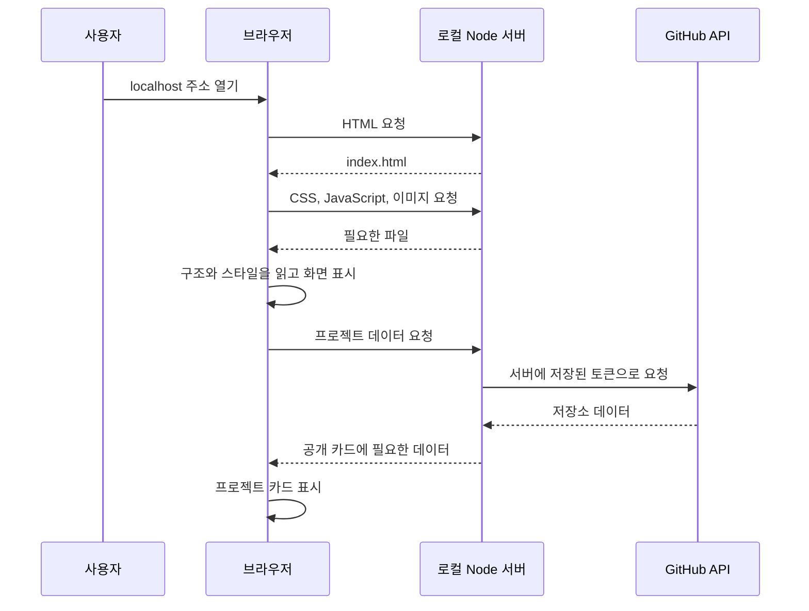
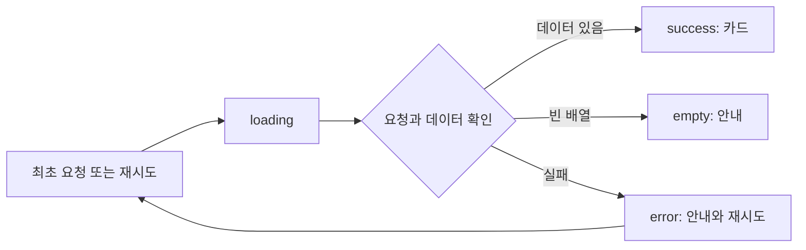

# 웹 개발 첫걸음 — 이 포트폴리오를 직접 만들기 위한 학습 안내

대상: 웹 개발을 처음 시작하는 사람<br>
기준 프로젝트: B1-1, hkk 포트폴리오<br>
작성일: 2026-09-10

이 문서는 완성된 코드를 외우기 위한 설명서가 아닙니다. **어떤 기능을 만들 때 무엇을 알아야 하고, 어떤 순서로 작은 코드를 붙여 나가는지** 설명합니다. 읽고 나면 제목을 표시하는 페이지에서 출발해 메뉴, 테마, 문의 폼, GitHub 프로젝트 목록까지 직접 확장하는 것이 목표입니다.

실행 방법만 필요하면 [README](README.md), 과제 조건은 [subject.md](subject.md), 작업 순서는 [PLAN.md](PLAN.md)를 봅니다. 여기서는 그 작업에 필요한 지식을 배웁니다.

## 읽는 순서

| 순서 | 배울 내용 | 직접 할 수 있어야 하는 일 |
| --- | --- | --- |
| 1 | 웹의 동작, 파일과 도구 | 현재 페이지를 실행하고 어떤 파일이 쓰이는지 찾기 |
| 2 | HTML | 제목, 소개, 이미지, 링크, 폼 만들기 |
| 3 | CSS | 색과 여백을 정하고 모바일에서도 읽기 좋게 배치하기 |
| 4 | JavaScript 기초 | 값 저장하기, 조건 판단하기, 함수와 배열 다루기 |
| 5 | DOM, 이벤트, 상태 | 버튼을 눌렀을 때 화면 바꾸기 |
| 6 | 저장과 입력 검증 | 테마 유지하기, 잘못된 폼 입력 안내하기 |
| 7 | HTTP, JSON, 비동기, API | GitHub 데이터를 받아 카드로 표시하기 |
| 8 | Node.js, 토큰, 환경 변수 | 토큰을 브라우저에 전달하지 않고 요청하기 |
| 9 | 디버깅, Git, 배포 | 오류 원인을 찾고 변경 사항과 결과물을 관리하기 |

처음에는 1~5를 먼저 익힙니다. API와 서버는 버튼 하나의 동작을 설명할 수 있게 된 뒤 학습해도 됩니다. 이 과제의 공개 GitHub 조회에는 토큰이 필수가 아니며, 현재 서버는 토큰을 사용하고 싶다는 요청에 맞춰 추가한 확장입니다.

## 1. 웹페이지가 화면에 나타나는 과정

### 브라우저와 서버

**브라우저**는 Chrome처럼 웹페이지를 열고 사용자의 클릭을 처리하는 프로그램입니다. **서버**는 요청을 받아 파일이나 데이터를 돌려주는 프로그램입니다. 개발 중에는 둘 다 내 컴퓨터에서 실행할 수 있습니다.

현재 프로젝트를 실행하면 다음 일이 일어납니다.



HTML·CSS·JavaScript는 각각 역할이 다릅니다.

| 종류 | 하는 일 | 이 프로젝트의 예 |
| --- | --- | --- |
| HTML | 내용과 구조를 표현하는 마크업 언어 | ‘자기소개’ 제목, 프로젝트 영역, 입력창 |
| CSS | 표시 방법을 정하는 스타일 언어 | 파란 버튼, 카드 간격, 모바일 배치 |
| JavaScript | 조건과 동작을 처리하는 프로그래밍 언어 | 클릭 처리, 테마 전환, API 조회 |

HTML로 버튼을 만들었다고 클릭 기능까지 생기지는 않습니다. CSS로 버튼 색을 바꾸는 것과 JavaScript로 버튼 클릭을 처리하는 것은 다른 작업입니다. 기초 개념을 더 살펴보려면 [MDN의 첫 웹사이트 안내](https://developer.mozilla.org/en-US/docs/Learn_web_development/Getting_started/Your_first_website)를 참고합니다.

### 주소 읽기

```text
http://127.0.0.1:4173/api/github/repos?username=hkk-cody
└─┬─┘ └───┬───┘ └┬─┘└──────┬───────┘└──────┬─────────┘
  방식     호스트   포트       경로             쿼리
```

- `http`: 통신 방식입니다. `https`는 전송 구간을 암호화합니다.
- `127.0.0.1`: 지금 브라우저가 실행되는 내 컴퓨터를 가리킵니다. `localhost`도 로컬 컴퓨터를 가리키는 이름입니다.
- `4173`: 어느 프로그램에 요청할지 구분하는 포트 번호입니다.
- `/api/github/repos`: 서버가 처리할 요청 경로입니다.
- `?username=hkk-cody`: 요청에 추가한 조건입니다.
- `#about`: 페이지 안의 위치를 가리키는 조각 식별자입니다. 일반적인 HTTP 요청에서 서버로 보내는 쿼리와 다릅니다.

친구에게 `localhost` 주소를 보내면 친구 컴퓨터를 가리키므로 내 사이트를 보여줄 수 없습니다. 다른 사람이 접근하게 하려면 배포가 필요합니다.

**확인 질문:** 메뉴를 여는 데 매번 서버 요청이 필요할까요?<br>
**답:** 현재 메뉴는 브라우저가 이미 받은 코드와 HTML로 처리하므로 필요하지 않습니다. GitHub의 최신 목록을 가져올 때는 요청이 필요합니다.

## 2. 코드를 쓰고 실행하는 도구

### 에디터, 터미널, 개발자 도구

| 도구 | 용도 | 예 |
| --- | --- | --- |
| VS Code 같은 에디터 | 프로젝트 파일 편집 | 소개 문구, CSS 수정 |
| 터미널 | 컴퓨터에 명령 실행 | `npm start`, `git status` |
| 브라우저 개발자 도구 | 실행된 페이지 관찰 | 오류 확인, 요소 검사, 통신 확인 |

터미널에 입력할 명령을 브라우저 Console에 입력하면 실행되지 않습니다. 반대로 `document.querySelector(...)`는 브라우저의 페이지를 다루는 코드이므로 일반 Node 터미널에는 `document`가 없습니다.

### 현재 프로젝트 실행

프로젝트 폴더를 터미널에서 연 뒤 실행합니다. Node.js 22 이상을 기준으로 작성되어 있습니다.

```sh
node --version
npm start
```

브라우저에서 [http://127.0.0.1:4173](http://127.0.0.1:4173)를 엽니다. 서버가 실행되는 동안 터미널이 명령을 기다리는 상태로 돌아오지 않는 것은 정상입니다. 종료할 때는 `Ctrl+C`를 누릅니다.

`npm start`는 마법 같은 웹 명령이 아닙니다. [package.json](package.json)의 `scripts.start`에 적힌 `node server.mjs`를 실행합니다. `npm`은 Node.js와 함께 사용하는 패키지·명령 관리 도구이고, 이 프로젝트에는 설치할 외부 패키지가 없습니다.

이미 서버가 실행 중이면 같은 포트로 또 실행하지 말고 열린 페이지를 사용합니다. `EADDRINUSE` 또는 ‘포트가 사용 중’이라는 안내는 기존 프로그램이 그 포트를 사용한다는 뜻입니다.

### 어떤 파일을 먼저 볼까?

| 파일 | 읽으면서 찾을 것 | 학습 순서 |
| --- | --- | --- |
| [index.html](index.html) | 섹션, 제목, 이미지, 버튼, 입력창 | 먼저 |
| [css/style.css](css/style.css) | 선택자, 여백, Flexbox, Grid, 미디어 쿼리 | 먼저 |
| [js/config.js](js/config.js) | 이름과 소개, 프로젝트 설명을 담은 객체 | 먼저 |
| [js/main.js](js/main.js) | 메뉴와 테마의 클릭 처리, 화면 갱신 | 다음 |
| [js/contact.js](js/contact.js) | 입력값 검사, 오류 메시지 | 다음 |
| [js/projects.js](js/projects.js) | 카드 데이터 변환, 상태별 화면 | 다음 |
| [js/github.js](js/github.js) | 데이터 요청, 기다림, 실패 처리 | 이후 |
| [server.mjs](server.mjs) | 파일 제공, 토큰을 넣은 GitHub 요청 | 마지막 |

`.env`는 비밀 설정 파일이고 `.env.example`은 값이 비어 있는 공유용 양식입니다. 학습 중에도 토큰 값을 Console에 출력하지 않습니다.

## 3. HTML — 무엇이 있는 페이지인지 표현하기

### 태그, 요소, 속성

```html
<a href="#about" class="text-link">자기소개 보기</a>
```

- `<a>`와 `</a>`는 시작·종료 태그입니다.
- 그 사이의 글은 내용입니다.
- `href`와 `class`는 추가 정보를 주는 속성입니다.
- 전체가 하나의 링크 요소입니다.

`href="#about"`은 `id="about"`인 요소로 이동합니다. `class="text-link"`는 CSS나 JavaScript가 그 요소를 찾아 사용할 수 있는 이름입니다.

### 문서의 기본 구조

다음은 구조를 설명하는 짧은 예시입니다. 현재 파일 전체를 이 코드로 덮어쓰지 않습니다.

```html
<!DOCTYPE html>
<html lang="ko">
  <head>
    <meta charset="UTF-8">
    <meta name="viewport" content="width=device-width, initial-scale=1.0">
    <title>내 포트폴리오</title>
    <link rel="stylesheet" href="css/style.css">
    <script src="js/main.js" defer></script>
  </head>
  <body>
    <header>사이트 이름과 메뉴</header>
    <main>
      <section id="about">
        <h1>안녕하세요.</h1>
        <p>개발을 공부하고 있습니다.</p>
      </section>
    </main>
    <footer>저작권과 외부 링크</footer>
  </body>
</html>
```

`head`는 문서 제목, 문자 인코딩, 파일 연결 같은 설정을 담습니다. `body`는 화면에 표시할 내용을 담습니다. `lang="ko"`는 문서의 주 언어를 알리고, viewport 설정은 모바일에서 화면 폭을 기준으로 레이아웃을 계산하도록 돕습니다.

### 시맨틱 태그를 쓰는 이유

시맨틱은 ‘의미를 담는다’는 뜻입니다. 태그를 통해 해당 부분이 메뉴인지, 본문인지, 독립적인 글인지 표현합니다.

- `nav`: 페이지 이동 메뉴.
- `main`: 페이지의 주된 본문.
- `section`: 제목과 함께 묶을 수 있는 주제 영역.
- `article`: 프로젝트 카드처럼 독립적으로 읽을 수 있는 콘텐츠.
- `div`: 특별한 의미 없이 레이아웃을 묶어야 하는 경우.

`section`을 사용한다고 자동으로 예쁜 배치가 생기지는 않습니다. 의미는 HTML, 배치는 CSS가 담당합니다. 제목도 크기만 보고 고르지 말고 `h1 → h2 → h3`의 내용 계층에 맞춰 사용합니다.

### 링크와 버튼은 다르다

```html
<a href="#projects">프로젝트로 이동</a>
<button type="button">테마 변경</button>
```

다른 주소나 위치로 이동하는 것은 링크, 메뉴 열기·테마 변경 같은 동작은 버튼을 사용합니다. `div`에 클릭만 붙이면 키보드 조작과 버튼 의미까지 직접 처리해야 하므로 기본 요소를 사용하는 편이 좋습니다.

`id`는 한 문서에서 고유해야 합니다. `class`는 여러 요소가 같은 스타일을 공유하도록 반복해서 붙일 수 있습니다.

### 이미지와 입력창

```html


<label for="email">이메일</label>
<input id="email" name="email" type="email" required>
```

`alt`는 이미지의 의미를 설명합니다. `label`의 `for`와 입력창의 `id`가 같아야 이름과 입력창이 연결됩니다. `placeholder`는 입력 예시일 뿐 label을 대신하지 않습니다. 장식만 하는 이미지는 빈 `alt`가 적절할 수 있지만, 이 프로젝트의 프로필은 의미 있는 설명을 사용합니다.

**실습:** 별도 연습 HTML에 이름, 소개 문단, GitHub 링크를 넣습니다. 링크를 Tab 키로 선택하고 Enter로 이동할 수 있는지 확인합니다.

## 4. CSS — 여백, 색, 배치를 정하기

### 선택자와 선언

```css
.hero-greeting {
  color: #2453ed;
  margin-bottom: 1rem;
}
```

`.hero-greeting`은 class가 `hero-greeting`인 요소를 고르는 **선택자**입니다. 중괄호 안의 `color`는 속성이고 `#2453ed`는 값입니다.

| 선택자 | 의미 |
| --- | --- |
| `p` | 모든 문단 |
| `.project-card` | 해당 class를 가진 요소 |
| `#projects` | 해당 id를 가진 요소 |
| `.project-card h3` | 카드 안의 h3 |
| `[data-theme="dark"]` | 해당 속성과 값을 가진 요소 |
| `.button:hover` | 마우스가 올라간 버튼 |
| `.button:focus-visible` | 키보드 등으로 포커스 표시가 필요한 버튼 |

여러 규칙이 같은 요소의 같은 속성을 바꾸면 우선순위가 적용됩니다. 일반적으로 더 구체적인 선택자가 우선하고, 그 조건까지 같으면 뒤의 선언이 이깁니다. 색이 바뀌지 않을 때 무조건 `!important`를 붙이기보다 개발자 도구의 Styles에서 어떤 규칙이 적용되는지 확인합니다.

### 박스 모델

요소의 크기는 내용, 안쪽 여백, 테두리, 바깥 여백을 구분해서 이해합니다.

```text
margin: 다른 요소와의 바깥 간격
┌───────────────────────────────┐
│ border: 테두리                │
│  ┌─────────────────────────┐  │
│  │ padding: 안쪽 여백      │  │
│  │    content: 실제 내용   │  │
│  └─────────────────────────┘  │
└───────────────────────────────┘
```

이 프로젝트는 `box-sizing: border-box`를 사용합니다. 예를 들어 `width: 200px`이면 테두리와 padding까지 포함한 폭이 200px입니다. margin은 그 밖에 붙습니다. 기본 `content-box`에서는 width가 내용 폭이므로 padding과 border가 더해집니다. [MDN 박스 모델 설명](https://developer.mozilla.org/en-US/docs/Learn_web_development/Core/Styling_basics/Box_model)

### 처음 알아둘 단위

- `px`: CSS 픽셀 단위. 화면의 물리 픽셀과 항상 1:1인 것은 아닙니다.
- `rem`: 루트 요소의 글자 크기를 기준으로 하는 단위. 루트가 16px일 때 `1rem`은 16px입니다.
- `%`: 속성에 따라 부모 등 기준이 되는 크기에 대한 비율입니다.
- `fr`: Grid에서 남는 공간을 나눌 때 사용하는 비율 단위입니다.

`width: 100%`와 `width: 100vw`는 다릅니다. 전자는 보통 부모의 폭, 후자는 뷰포트 폭을 기준으로 합니다. 뷰포트는 브라우저에서 페이지가 표시되는 영역입니다.

### Flexbox와 Grid

```css
.navigation {
  display: flex;
  justify-content: space-between;
  align-items: center;
}

.projects-grid {
  display: grid;
  grid-template-columns: repeat(auto-fit, minmax(min(100%, 19rem), 1fr));
  gap: 1.5rem;
}
```

Flexbox는 메뉴처럼 주로 한 방향으로 정렬할 때 편리합니다. 위 코드에서는 요소 사이에 공간을 나눠 넣고 세로 중앙을 맞춥니다. Grid는 카드처럼 행과 열의 구조를 함께 다룰 때 편리합니다.

복잡해 보이는 Grid 선언은 다음 뜻입니다.

1. `repeat`: 같은 열 규칙을 반복합니다.
2. `auto-fit`: 현재 폭에 들어갈 수 있는 열을 만듭니다.
3. `minmax`: 열 폭의 최솟값과 최댓값을 정합니다.
4. `min(100%, 19rem)`: 좁은 부모 폭보다 최소 카드 폭이 커지지 않게 합니다.
5. `1fr`: 남는 공간을 열 사이에 나눕니다.

처음에는 `grid-template-columns: 1fr 1fr`로 두 열을 만든 뒤 자동 반응형으로 확장해도 됩니다.

### 반응형과 미디어 쿼리

```css
.skills-grid {
  display: grid;
  grid-template-columns: 1fr;
}

@media (min-width: 768px) {
  .skills-grid { grid-template-columns: repeat(2, 1fr); }
}

@media (min-width: 1024px) {
  .skills-grid { grid-template-columns: repeat(4, 1fr); }
}
```

작은 화면의 기본 스타일을 먼저 쓰고 큰 화면에서 덮어쓰는 방식을 모바일 퍼스트라고 합니다. 768px과 1024px은 이 과제의 기준이며 모든 웹사이트가 반드시 따라야 하는 숫자는 아닙니다.

반응형은 글자만 작게 만드는 일이 아닙니다. 열 수, 메뉴 방식, 간격, 버튼과 입력창의 사용성을 함께 조절합니다.

### CSS 변수와 테마

```css
:root {
  --color-bg: #ffffff;
  --color-text: #191c27;
}

[data-theme="dark"] {
  --color-bg: #12151d;
  --color-text: #f3f5fb;
}

body {
  background: var(--color-bg);
  color: var(--color-text);
}
```

변수에 색의 역할을 붙여 놓으면 여러 요소의 색을 한 번에 바꿀 수 있습니다. 여기서 `var(...)`는 CSS 변수 사용 문법입니다. 과제에서 금지한 JavaScript의 `var` 선언과는 다릅니다.

**실습:** 개발자 도구에서 창 폭을 375px, 768px, 1024px로 바꿉니다. 카드 열 수와 메뉴 방식이 바뀌는 지점을 관찰합니다. Styles에서 padding을 바꾸어 보고, 새로고침하면 파일에 저장하지 않은 수정이 사라지는지도 확인합니다.

## 5. JavaScript — 값과 규칙으로 동작 만들기

### 변수와 값

다음은 브라우저 Console에서 실행해 볼 수 있습니다. 다시 실행할 때 같은 `const` 이름을 재선언해 오류가 나면 페이지를 새로고침합니다.

```js
const displayName = 'hkk';
let projectCount = 6;
const isMenuOpen = false;

projectCount = projectCount + 1;
console.log(displayName, projectCount, isMenuOpen);
```

예상 결과는 `hkk`, `7`, `false`입니다.

- 문자열: `'hkk'`처럼 따옴표로 감싼 글자.
- 숫자: `6`, `0.2`.
- 불리언: 참·거짓을 나타내는 `true`, `false`.
- `null`: 값이 없음을 명시적으로 표현할 때 사용.
- `undefined`: 아직 값이 지정되지 않은 경우 등에 나타남.
- `const`: 변수에 다른 값을 다시 대입하지 않음.
- `let`: 변수에 다른 값을 다시 대입할 수 있음.

`const`가 객체 내부의 모든 값을 고정한다는 뜻은 아닙니다.

```js
const demoState = { theme: 'light' };
demoState.theme = 'dark'; // 가능: 객체 안의 속성 변경
// demoState = {};       // 불가능: 변수에 다른 객체를 대입
```

현재 설정에 쓰는 `Object.freeze`는 객체의 바로 아래 속성 변경을 제한합니다. 중첩된 객체와 배열까지 모두 고정하는 깊은 동결은 아닙니다.

### 객체와 배열

객체는 이름을 붙인 데이터 묶음이고, 배열은 순서가 있는 목록입니다.

```js
const project = {
  name: 'Mini Git CLI',
  language: 'Python',
};

const projects = [project, { name: '포트폴리오', language: 'JavaScript' }];

console.log(project.name);     // Mini Git CLI
console.log(projects[0].name); // Mini Git CLI — 배열의 첫 위치는 0
console.log(projects.length);  // 2
```

[js/config.js](js/config.js)는 대부분 객체와 배열로 이루어져 있습니다. 소개 문구를 고칠 때는 알고리즘을 바꾸는 대신 그 데이터 값을 바꾸면 됩니다.

### 조건과 연산자

```js
const email = '  ';

if (email.trim() === '') {
  console.log('이메일을 입력해 주세요.');
} else {
  console.log('값이 있습니다.');
}
```

`trim()`은 문자열 양끝 공백을 제거합니다. 이 예시는 이메일 형식 검사가 아니라 빈 값 검사입니다.

| 표현 | 의미 |
| --- | --- |
| `=` | 대입 |
| `===` | 타입까지 고려해 같은지 비교 |
| `!value` | 참·거짓 판단을 뒤집기 |
| `a && b` | a가 참으로 평가될 때 b까지 확인 |
| `a || b` | a가 거짓으로 평가되면 b 사용 |
| `value ?? fallback` | value가 null 또는 undefined일 때만 기본값 사용 |
| `condition ? a : b` | 조건이 참이면 a, 아니면 b |

`0 || 10`은 10이고 `0 ?? 10`은 0입니다. 숫자 0을 유효한 값으로 보존해야 할 때 차이가 중요합니다.

### 함수와 콜백

함수는 이름을 붙여 다시 실행할 수 있게 만든 동작입니다. 입력을 받아 결과를 돌려줄 수도 있습니다.

```js
const createGreeting = (name) => {
  return `안녕하세요, ${name}입니다.`;
};

console.log(createGreeting('hkk'));
```

`(name) => { ... }`은 화살표 함수이고, 백틱으로 감싼 문자열은 템플릿 리터럴입니다. `${name}` 자리에 실제 값이 들어갑니다.

다른 함수에 전달해서 나중에 실행하도록 맡기는 함수를 콜백이라고 합니다. 클릭 시 실행할 함수도 콜백입니다.

### 구조분해와 배열 메서드

```js
const sample = { name: 'Mini Redis', language: 'Python' };
const { name, language } = sample;

const items = [
  { name: 'Mini Git', language: 'Python' },
  { name: 'Portfolio', language: 'JavaScript' },
];

const titles = items.map((item) => item.name);
const pythonItems = items.filter((item) => item.language === 'Python');
items.forEach((item) => console.log(item.name));
```

- 구조분해: 객체 속성을 꺼내 같은 이름의 변수로 받습니다.
- `map`: 각 항목을 변환한 새 배열을 반환합니다. `titles`는 이름 두 개의 배열입니다.
- `filter`: 조건을 만족하는 항목만 담은 새 배열을 반환합니다.
- `forEach`: 각 항목에 대해 동작을 실행합니다. 변환 결과 배열을 얻는 용도가 아닙니다.
- `slice(0, 6)`: 앞의 최대 여섯 항목을 담은 새 배열을 만듭니다.
- `sort`: 원본 배열을 정렬합니다. 현재 코드는 `[...repositories]`로 배열을 얕게 복사한 뒤 정렬합니다.

**실습:** 위 `items`에 SQL 프로젝트 하나를 추가하고 이름 세 개를 `map`으로 얻습니다. 원본 배열의 길이와 Python 필터 결과의 길이가 각각 얼마인지 확인합니다.

## 6. DOM과 이벤트 — 화면을 코드로 다루기

### DOM은 무엇인가?

브라우저는 HTML을 읽어 제목, 문단, 버튼을 부모·자식 관계의 객체 구조로 만듭니다. 이 구조가 DOM입니다. JavaScript는 DOM을 통해 이미 화면에 있는 요소를 찾고 바꿉니다.

현재 홈페이지를 연 브라우저 Console에서 실행해 봅니다.

```js
document.querySelector('.hero-greeting').textContent = 'DOM으로 인사말을 바꿨습니다.';
```

화면의 인사말이 바뀌지만 `index.html` 파일 자체는 수정되지 않습니다. 새로고침하면 코드가 다시 실행되어 원래 문구로 돌아옵니다.

| 코드 | 역할 |
| --- | --- |
| `querySelector('.button')` | 조건에 맞는 첫 요소, 없으면 null |
| `querySelectorAll('.button')` | 조건에 맞는 요소들의 목록 |
| `element.textContent` | 글자로 내용 설정 |
| `input.value` | 입력창에 입력된 값 |
| `element.classList.add('active')` | class 추가 |
| `element.classList.remove('active')` | class 제거 |
| `element.classList.toggle('active', true)` | 두 번째 값에 맞춰 class를 켜거나 끄기 |
| `element.hidden = true` | 요소 숨기기 |
| `element.setAttribute(...)` | HTML 속성 설정 |

`Cannot read properties of null`은 선택한 요소가 없는데 속성을 사용했을 때 흔히 나타납니다. 선택자의 철자와 HTML 로딩 시점을 확인합니다.

### 이벤트 연결

다음은 동작 구조를 설명하는 예시입니다. 현재 코드에는 이미 클릭 처리가 있으므로 같은 버튼에 중복해서 추가하지 않습니다.

```js
const button = document.querySelector('#theme-toggle');

const handleClick = () => {
  console.log('버튼을 눌렀습니다.');
};

button.addEventListener('click', handleClick);
```

`handleClick`은 함수를 전달합니다. `handleClick()`은 지금 즉시 함수를 실행합니다. 이벤트를 등록할 때 둘을 혼동하지 않습니다.

현재 프로젝트는 `click`, `input`, `submit`, `scroll` 등의 이벤트를 사용합니다. 사용자의 행동이 이벤트를 발생시키고, 등록한 함수가 그때 실행됩니다.

### 왜 defer를 붙였을까?

HTML 위쪽에서 아직 만들어지지 않은 버튼을 찾으면 실패할 수 있습니다. 외부 일반 스크립트에 `defer`를 붙이면 HTML 파싱이 끝난 뒤 실행하고, defer 스크립트끼리는 문서에 적힌 순서를 지킵니다.

현재 순서는 다음과 같습니다.

```text
config.js → main.js → projects.js → github.js → contact.js
설정 준비    기본 UI    카드 기능 준비   데이터 요청    폼 연결
```

`github.js`는 `projects.js`가 공개한 기능을 사용하므로 뒤에 와야 합니다.

### 파일 바깥으로 변수가 섞이지 않게 하기

```js
(() => {
  const internalValue = 1;
})();
```

함수를 만들자마자 실행하는 형태로, 내부 변수의 범위를 묶습니다. 현재 파일들은 이 패턴을 사용하고, 다른 파일과 공유해야 하는 설정이나 함수만 `window.PORTFOLIO_CONFIG`, `window.PortfolioProjects`에 명시적으로 넣습니다.

처음부터 이 모양을 외우기보다 ‘각 파일의 내부 변수는 가리고 필요한 기능만 공유한다’는 목적을 이해합니다.

## 7. 작은 실습 — 버튼 하나로 상태와 화면 연결하기

아래 실습은 **기존 프로젝트 밖의 새 연습 폴더**에 `index.html`, `style.css`, `main.js` 세 파일을 만들어 진행합니다. 토큰이나 `.env`를 복사할 필요가 없습니다. 이 작은 예제는 Live Server로 열 수 있습니다.

### index.html

```html
<!DOCTYPE html>
<html lang="ko" data-theme="light">
  <head>
    <meta charset="UTF-8">
    <meta name="viewport" content="width=device-width, initial-scale=1.0">
    <title>테마 연습</title>
    <link rel="stylesheet" href="style.css">
    <script src="main.js" defer></script>
  </head>
  <body>
    <main>
      <h1>내 첫 인터랙션</h1>
      <p id="theme-status"></p>
      <button id="theme-button" type="button" aria-pressed="false">다크 모드 켜기</button>
    </main>
  </body>
</html>
```

### style.css

```css
:root {
  --background: white;
  --text: #191c27;
}

[data-theme="dark"] {
  --background: #12151d;
  --text: #f3f5fb;
}

body {
  background: var(--background);
  color: var(--text);
  font-family: sans-serif;
  margin: 2rem;
}

button { padding: 0.75rem 1rem; }
button:focus-visible { outline: 3px solid #5b7fff; }
```

### main.js

```js
const button = document.querySelector('#theme-button');
const message = document.querySelector('#theme-status');
const state = { isDark: false };

const render = () => {
  document.documentElement.dataset.theme = state.isDark ? 'dark' : 'light';
  message.textContent = state.isDark ? '현재 다크 모드입니다.' : '현재 라이트 모드입니다.';
  button.textContent = state.isDark ? '라이트 모드 켜기' : '다크 모드 켜기';
  button.setAttribute('aria-pressed', String(state.isDark));
};

button.addEventListener('click', () => {
  state.isDark = !state.isDark;
  render();
});

render();
```

클릭하면 배경·본문색·안내·버튼 설명이 함께 바뀌어야 합니다. 핵심은 `state.isDark`라는 하나의 값에서 화면을 계산한다는 점입니다.

```text
버튼 클릭 → state.isDark 변경 → render 실행 → DOM과 CSS 변경
```

`render`는 정해진 JavaScript 예약어가 아닙니다. 개발자가 ‘현재 상태를 화면에 반영한다’는 뜻으로 붙인 함수 이름입니다. 상태를 바꾸기만 하고 `render()`를 호출하지 않으면 이 예제의 화면은 바뀌지 않습니다.

**확장 실습:** `state.isDark`의 초기값을 true로 바꿔 봅니다. 페이지를 열자마자 어떤 상태가 되어야 할까요? 이후 8장의 저장 기능을 붙여 새로고침 후에도 유지해 봅니다.

## 8. 상태 저장과 화면 조작 더 알아보기

### 메모리의 값과 localStorage

일반 변수는 페이지를 새로고침하면 다시 초기화됩니다. localStorage는 브라우저에 문자열을 저장해 이후 방문에서도 꺼내 쓸 수 있게 합니다.

```js
localStorage.setItem('practice-theme', 'dark');
console.log(localStorage.getItem('practice-theme')); // dark
localStorage.removeItem('practice-theme');
```

저장 범위는 출처(origin)별입니다. 출처는 프로토콜·호스트·포트의 조합이므로 `localhost:4173`과 `127.0.0.1:4173`의 저장값은 공유되지 않습니다. 저장은 사용자 설정이나 환경에 따라 실패할 수 있어 실제 [main.js](js/main.js)는 `try/catch`로 감쌉니다. localStorage는 비밀번호·토큰을 안전하게 숨기는 저장소가 아닙니다. [MDN localStorage 설명](https://developer.mozilla.org/en-US/docs/Web/API/Window/localStorage)

현재 테마의 흐름은 ‘저장값 읽기 → 상태 초기화 → 화면 갱신 → 클릭 시 상태·저장값 갱신’입니다. 유효하지 않은 저장값은 라이트 모드로 처리합니다.

### 모바일 메뉴

메뉴는 `isMenuOpen`이라는 불리언 상태를 사용합니다. `active` class는 CSS에 표시 여부를 알리고, `aria-expanded`는 보조 기술에 펼침 상태를 알립니다. 둘을 같은 상태에서 계산해야 서로 어긋나지 않습니다.

열기만 구현하면 끝이 아닙니다. 다시 클릭, 메뉴 링크 선택, Escape, 화면 폭 변경 때 닫히는지도 확인합니다.

### 스크롤과 등장 효과

- `window.scrollY`: 현재 세로 스크롤 위치.
- `position: sticky`: 스크롤할 때 지정한 위치에 붙는 헤더 등에 사용.
- `position: fixed`: 화면 기준으로 고정하는 상단 이동 버튼 등에 사용.
- `scroll-margin-top`: 앵커 이동 후 제목이 고정 헤더에 가려지지 않게 여유를 줌.
- Intersection Observer: 요소와 화면 영역의 교차 상태를 관찰.

이 프로젝트는 60px 이상에서 헤더 스타일을 바꾸고, 300px 이상에서 상단 이동 버튼을 보여줍니다. 등장 효과의 `threshold: 0.2`는 보통 대상 요소의 약 20%가 교차하는 기준입니다. 화면보다 지나치게 큰 요소는 조건을 만족하기 어려울 수 있어 숨기지 않도록 처리했습니다.

스크롤 이벤트는 자주 발생하므로 `requestAnimationFrame`으로 다음 화면 갱신 시점에 처리를 모읍니다. 동작 감소 설정이 켜져 있으면 애니메이션을 줄입니다. 처음 만들 때는 애니메이션보다 내용이 항상 읽히는 것을 먼저 확인합니다.

## 9. 문의 폼 — 입력, 검사, 안내 분리하기

현재 문의 폼은 이름, 이메일, 메시지를 받습니다. 세 가지 책임을 구분합니다.

1. **읽기:** `input.value`에서 입력값을 얻습니다.
2. **검사:** 비었는지, 이메일 형식이 맞는지 판단합니다.
3. **안내:** 필드 아래에 오류를 표시하거나 성공 안내를 표시합니다.

폼 제출에는 브라우저 기본 동작이 있으므로 현재 코드는 `submit` 이벤트에서 `event.preventDefault()`를 호출합니다. 이 호출이 유효성 검사를 대신해 주는 것은 아닙니다.

```js
const isBlank = (value) => value.trim() === '';

console.log(isBlank('   ')); // true
console.log(isBlank('hkk')); // false
```

이메일은 `type="email"`을 사용하고 `input.validity.typeMismatch`로 형식 오류를 확인합니다. 형식이 올바르다는 것은 그 이메일 주소가 실제 존재하거나 메일을 받을 수 있다는 뜻은 아닙니다.

오류가 나면 글자를 빨갛게 만드는 것만으로 끝내지 않습니다. 설명 문구, `aria-invalid`, `aria-describedby`, 첫 오류 입력창으로의 포커스를 함께 제공합니다. 입력을 수정하면 이미 표시된 오류를 다시 검사하고, 이전 성공 메시지를 정리합니다.

현재 [contact.js](js/contact.js)의 `validated`는 검사했던 필드 이름을 `Set`으로 보관합니다. Set은 중복 없이 값을 모으는 자료구조입니다. 덕분에 사용자가 처음 한 글자를 입력할 때부터 모든 오류가 뜨는 상황을 피합니다.

**실습:** 빈 폼 제출 → 공백만 입력 → 잘못된 이메일 입력 → 정상 입력 순으로 확인합니다. 마지막 단계에서 페이지 이동 없이 입력 확인 메시지가 보여야 합니다.

현재 폼은 메시지를 전송하지 않습니다. 실제 전송을 추가한다면 서버에서도 입력을 검증해야 합니다. 브라우저의 검사는 사용자가 우회할 수 있으므로 신뢰할 수 있는 최종 검증이 아닙니다.

## 10. HTTP, API, JSON — 다른 서비스의 데이터 받기

### API와 토큰은 다른 것

API는 프로그램끼리 요청하고 결과를 받는 약속입니다. 토큰은 일부 요청에서 누가 요청하는지 증명하는 인증 정보입니다. API를 사용한다는 말이 항상 토큰을 발급받아야 한다는 뜻은 아닙니다.

현재 사용하는 주소는 다음과 같습니다.

```text
https://api.github.com/users/hkk-cody/repos?sort=updated&per_page=100
```

이 요청은 지정한 사용자의 공개 저장소를 조회합니다. `sort=updated`는 정렬 조건이고 `per_page=100`은 한 번의 응답 크기 조건입니다. 현재 구현은 첫 페이지를 요청한 뒤 대표 작업을 우선해 최대 여섯 개를 표시합니다. 저장소가 100개를 넘을 때 모든 페이지를 순회하는 구현은 아닙니다.

### 요청과 응답에 들어 있는 것

| 항목 | 뜻 | 예 |
| --- | --- | --- |
| 메서드 | 요청의 종류 | `GET`: 조회, `POST`: 데이터 제출 등에 사용 |
| 경로 | 무엇을 요청하는지 | `/api/github/repos` |
| 헤더 | 요청·응답의 부가 정보 | `Accept`, `Content-Type`, 서버의 `Authorization` |
| 본문 | 전달하는 데이터 | 저장소 목록 JSON |
| 상태 코드 | 처리 결과 | 200, 401, 403, 404, 429, 500 |

200은 정상 응답입니다. 401은 인증 실패, 403은 권한 부족이나 요청 제한, 404는 경로·대상을 찾지 못한 상황, 429는 요청 과다를 나타낼 수 있습니다. GitHub의 모든 403을 동일한 원인으로 단정하지 말고 응답과 문서를 함께 확인합니다.

### JSON은 데이터 형식

```json
[
  {
    "name": "B5-2",
    "language": "Python",
    "description": null
  }
]
```

JSON은 언어 사이에서 데이터를 주고받기 위한 텍스트 형식입니다. 속성 이름과 문자열에는 큰따옴표를 쓰며, 함수나 주석을 넣지 않습니다. JavaScript 객체와 생김새가 비슷하지만 같은 개념은 아닙니다.

`JSON.parse`는 JSON 문자열을 JavaScript 값으로 바꾸고, `JSON.stringify`는 JavaScript 값을 JSON 문자열로 바꿉니다. 현재 서버는 객체를 JSON 문자열로 만들어 응답하고, 브라우저는 그 문자열을 다시 배열과 객체로 읽습니다.

## 11. 비동기 — 응답을 기다리는 동안의 동작

### Promise, async, await

네트워크 응답은 즉시 도착하지 않습니다. Promise는 나중에 성공하거나 실패할 작업의 결과를 나타냅니다. `async` 함수는 Promise를 반환하고, `await`는 그 함수 안에서 결과를 기다리는 표현입니다. 기다리는 동안 브라우저 전체가 멈추는 것은 아닙니다.

다음은 흐름을 익히기 위한 Console 예시입니다. 현재 사이트의 자동 요청과 별개로 요청 한 번을 추가하므로 반복 실행하지 않습니다.

```js
const practiceLoad = async () => {
  try {
    const response = await fetch('/api/github/repos?username=hkk-cody');
    if (!response.ok) {
      throw new Error(`HTTP ${response.status}`);
    }
    const repositories = await response.json();
    console.log(`저장소 ${repositories.length}개를 받았습니다.`);
  } catch {
    console.log('조회하지 못했습니다. Network 탭에서 상태를 확인하세요.');
  }
};

practiceLoad();
```

이 예시는 `npm start`로 실행한 로컬 페이지용입니다. GitHub Pages에는 해당 로컬 서버 경로가 없습니다.

`fetch`는 404나 500 응답 자체만으로 자동 실패 처리되지 않습니다. 따라서 `response.ok`를 검사합니다. `response.json()`도 본문을 읽는 비동기 작업이므로 별도로 기다립니다. 네트워크 실패나 JSON 해석 오류도 처리해야 합니다. [MDN fetch 사용법](https://developer.mozilla.org/en-US/docs/Web/API/Fetch_API/Using_Fetch)

### 성공 이외의 화면도 설계한다



요청 전에 로딩을 표시해야 기다리는 중인지 알 수 있습니다. 빈 목록은 서버 오류가 아닐 수 있으므로 별도 화면으로 표현합니다. 실패했을 때는 재시도 경로가 필요합니다.

현재 [github.js](js/github.js)는 중복 요청을 막는 `isLoading`, 요청을 취소하는 `AbortController`, 정리 작업을 실행하는 `finally`도 사용합니다. `finally`에서는 성공·실패와 관계없이 타이머를 해제하고 다음 요청을 허용합니다.

처음에는 기본 요청과 `try/catch`부터 만들고, 네 가지 상태를 확인한 뒤 시간 제한과 중복 방지를 추가합니다.

## 12. 받은 데이터를 카드로 바꾸기

API는 카드 디자인을 보내주지 않습니다. 저장소 데이터가 도착하면 내가 화면에 필요한 형태로 바꿔야 합니다.

현재 처리 흐름은 다음과 같습니다.

```text
github.js: 저장소 배열 받기
  → projects.js: setRepositories
  → 대표 저장소 우선 정렬, 앞의 여섯 개 선택
  → 설명·태그 등 카드 데이터 구성
  → setState로 상태 변경
  → renderProjects로 화면 갱신
```

현재 홈페이지의 프로젝트 이름과 설명은 [config.js](js/config.js)의 `repositoryDetails`에서 보충합니다. 실제 응답에 없는 저장소를 새로 만들어 표시하지 않습니다. 스타 수와 링크는 응답 데이터를 사용합니다.

### textContent와 innerHTML

`textContent`는 값을 글자로 취급합니다. `innerHTML`은 값을 HTML로 해석합니다. 사용자가 입력했거나 외부 API에서 받은 문자열을 그대로 `innerHTML`에 넣으면 의도하지 않은 태그가 만들어질 수 있습니다.

현재 코드는 카드 전체를 템플릿 문자열로 만들기 때문에 이름과 설명의 HTML 특수문자를 이스케이프합니다. 링크도 HTTPS GitHub 주소인지 확인합니다. 일반 안내 문구는 `textContent`로 넣습니다.

처음 연습할 때는 `document.createElement`로 요소를 만들고 `textContent`로 값을 넣는 방식부터 사용할 수도 있습니다. 과제의 템플릿 리터럴·`innerHTML` 요구를 적용할 때는 외부 문자열 처리도 함께 구현합니다.

**실습:** 최초 API 요청이 끝난 후 Console에서 다음 명령을 하나씩 실행합니다.

```js
PortfolioProjects.setState({ status: 'loading' });
PortfolioProjects.setRepositories([]);
PortfolioProjects.setState({ status: 'error' });
```

각각 로딩, 빈 상태, 재시도 화면이 나와야 합니다. 오류 화면의 재시도 버튼을 누르면 실제 요청이 다시 실행됩니다. 이 명령은 GitHub 데이터를 바꾸지 않고 현재 페이지의 표시 상태만 바꿉니다.

## 13. Node.js와 .env — 토큰을 사용하는 부분

### 같은 JavaScript라도 실행 장소가 다르다

| 항목 | 브라우저 JavaScript | Node.js 서버 JavaScript |
| --- | --- | --- |
| 실행 장소 | 방문자의 브라우저 | 서버 프로세스가 실행되는 컴퓨터 |
| 이 프로젝트 파일 | `js/` 안의 파일 | `server.mjs` |
| 주요 기능 | DOM, 클릭, 화면 표시 | 파일 읽기, HTTP 응답, GitHub 요청 |
| 대표 객체 | `window`, `document` | `process`, Node 기본 모듈 |
| 토큰 보관 | 하지 않음 | 환경 변수로 읽음 |

Node.js는 브라우저 밖에서 JavaScript를 실행하는 환경입니다. `.mjs`는 Node에서 ES 모듈로 읽는 파일 확장자이며, 현재 서버는 `import`로 `node:http`, `node:fs/promises` 같은 기본 기능을 사용합니다. 프레임워크나 외부 라이브러리를 설치한 것은 아닙니다.

### .env와 .gitignore의 역할

```dotenv
# 설정 형태만 보여 주는 예시입니다. 실제 토큰을 문서에 적지 않습니다.
GITHUB_TOKEN=
PORT=4173
```

`.env`는 이름과 값을 적은 텍스트 파일입니다. 그 자체가 암호화된 금고이거나 자동 실행되는 파일은 아닙니다. 현재 서버가 시작할 때 Node의 `loadEnvFile`로 읽고, `process.env.GITHUB_TOKEN`으로 값을 사용합니다. 환경 파일의 값은 기본적으로 문자열이므로 포트는 숫자로 변환합니다. [Node.js 환경 파일 로딩](https://nodejs.org/docs/latest-v22.x/api/process.html#processloadenvfilepath)

`.gitignore`는 Git이 새 파일을 추적할 때 제외할 규칙을 정합니다. 두 파일의 역할은 다릅니다.

| 보호할 경로 | 현재 처리 |
| --- | --- |
| Git 저장소에 토큰이 올라가는 것 | `.gitignore`에 `.env`, `.env.*` 등록 |
| 웹 주소로 `.env`를 내려받는 것 | 서버가 허용한 공개 파일만 제공 |
| 브라우저 JavaScript에 토큰이 들어가는 것 | 서버만 환경 변수를 읽고 인증 헤더 생성 |
| 오류 메시지에 토큰이 섞이는 것 | 원본 예외·인증 헤더를 응답과 로그에 출력하지 않음 |

이미 Git이 추적한 파일은 `.gitignore`에 추가해도 과거 기록에서 사라지지 않습니다. 실제 토큰이 공개됐다면 기록을 가리는 작업만으로 해결하지 말고 해당 토큰을 폐기하고 새로 발급해야 합니다.

### 실제 요청 순서

1. 브라우저는 자기 사이트의 `/api/github/repos`에 요청합니다. 토큰은 없습니다.
2. Node 서버는 `.env`에서 읽어 둔 토큰으로 `Authorization` 헤더를 만듭니다.
3. 서버가 GitHub API에 요청합니다.
4. 응답에서 공개 저장소의 카드 필드만 추립니다.
5. 브라우저에는 데이터만 돌려줍니다.

이처럼 요청을 중간에서 대신하는 역할을 프록시라고 합니다. 현재 서버는 로컬 개발용으로 `127.0.0.1`에 바인딩되며, 일반적인 공개 서버 배포 설정까지 갖춘 서비스는 아닙니다.

### 기억할 경계

`.env` 값을 빌드해서 브라우저 JavaScript에 넣으면 방문자가 볼 수 있습니다. Git에 올리지 않았다는 사실만으로 브라우저에서 숨겨지는 것은 아닙니다. 토큰을 `localStorage`에 옮겨도 같은 문제가 남습니다.

현재 `.env`를 고쳤다면 서버를 재시작해야 새 값을 읽습니다. 페이지 새로고침만으로 서버의 환경 변수가 다시 로딩되지는 않습니다.

**확인 실습:** 터미널에서 `git check-ignore .env`를 실행하면 `.env`가 출력되어야 합니다. 브라우저에서 로컬 주소 뒤에 `/.env`를 붙이면 파일 내용 대신 404가 나와야 합니다. 토큰 값을 출력해서 확인할 필요가 없습니다.

## 14. GitHub Pages, 인증, CORS 구분하기

### 로컬 서버와 배포 환경

GitHub Pages는 HTML·CSS·JavaScript 같은 정적 파일을 제공하는 호스팅입니다. 현재의 `server.mjs`를 실행해 주지 않습니다. 그래서 Pages에서는 브라우저가 토큰 없이 GitHub 공개 API를 직접 호출하도록 작성했습니다. [.nojekyll](.nojekyll)은 기본 Jekyll 처리를 건너뛰도록 표시하는 빈 파일이며 Node 서버를 켜는 설정이 아닙니다. [GitHub Pages 설명](https://docs.github.com/en/pages/getting-started-with-github-pages/what-is-github-pages)

| 환경 | 데이터 요청 경로 | 실제 토큰 사용 |
| --- | --- | --- |
| 로컬 `npm start` | 브라우저 → Node → GitHub | `.env`에 값이 있으면 서버에서 사용 |
| GitHub Pages | 브라우저 → GitHub | 사용하지 않음 |

GitHub의 인증 없는 공개 REST 요청은 일반적으로 IP 기준 시간당 60회, 개인 인증 요청은 일반적으로 시간당 5,000회 제한이 적용됩니다. 엔드포인트와 인증 방식에 따라 다른 제한이나 추가 제한이 있을 수 있으므로 오류 응답을 처리해야 합니다. [GitHub 요청 제한](https://docs.github.com/en/rest/using-the-rest-api/rate-limits-for-the-rest-api)

### CORS는 토큰 보안과 다른 문제

출처가 다른 서버의 응답을 브라우저 JavaScript가 읽을 수 있는지는 CORS 정책의 영향을 받습니다. CORS 오류는 보통 서버가 해당 출처의 읽기를 허용하지 않아 발생합니다. 현재 로컬 요청은 같은 출처의 서버를 사용합니다.

`mode: 'no-cors'`를 붙이면 응답 JSON을 자유롭게 읽을 수 있게 되는 것이 아닙니다. 응답이 불투명해져 읽지 못할 수 있습니다. 또한 CORS 설정이 토큰을 브라우저에서 숨겨 주는 것도 아닙니다.

## 15. 오류를 찾는 순서

처음에는 ‘안 된다’ 대신 **어느 단계까지 됐는지** 나눠서 관찰합니다.

| 증상 | 먼저 볼 곳 | 확인할 내용 |
| --- | --- | --- |
| 페이지가 열리지 않음 | 터미널, 주소창 | 서버 실행 여부, 포트, 주소 |
| CSS가 적용되지 않음 | Network | `style.css` 요청의 상태와 경로 |
| 버튼이 반응하지 않음 | Console, Elements | 오류, id 철자, 스크립트 로딩 |
| 소개를 바꿨는데 원래대로 돌아옴 | `config.js` | JavaScript가 HTML 기본 문구를 덮어쓰는지 |
| 프로젝트만 오류 | Network의 API 요청 | HTTP 상태, 응답이 배열인지, 사용자명 |
| 401 | 서버 설정 | 토큰 유효성, 서버 재시작 여부 |
| 403 또는 429 | API 응답, 요청 횟수 | 권한·요청 제한, 반복 호출 여부 |
| 새로고침 후 테마가 다름 | 주소창, Application | 같은 origin인지, 저장값이 있는지 |
| 모바일 가로 스크롤 | Elements, 화면 폭 | 고정 폭, padding, 긴 글자, Grid 최소 폭 |

개발자 도구의 주요 탭은 다음처럼 사용합니다.

- **Elements:** 실제 DOM과 적용된 스타일을 확인합니다. HTML 소스와 실행 후 DOM이 다를 수 있습니다.
- **Console:** 오류 메시지와 짧은 JavaScript 결과를 확인합니다. 오류가 여러 개면 먼저 발생한 것부터 봅니다.
- **Network:** 요청 주소·상태 코드·응답을 봅니다. 현재 토큰 인증은 서버에서 수행하므로 브라우저 요청에 GitHub 토큰이 없어야 정상입니다.
- **Application:** 해당 origin의 localStorage를 확인합니다.

요청 헤더나 로그를 공유할 때는 인증 정보를 포함하지 않았는지 확인합니다. 현재 서버는 이를 출력하지 않지만, 다른 도구에서 보이는 내용까지 자동으로 안전한 것은 아닙니다.

## 16. 테스트와 Git으로 작업 관리하기

### 수동 확인과 자동 테스트

```sh
npm test
```

현재 테스트는 가짜 GitHub 응답과 가짜 토큰을 사용합니다. 토큰 전달이 서버 안에서 이뤄지는지, `.env` 접근을 막는지, 실패와 재시도를 처리하는지 반복 확인합니다. 실행이 성공해도 내 실제 토큰의 현재 유효성까지 증명한 것은 아닙니다. 실제 인증 확인은 별도 요청으로 해야 합니다.

화면의 줄바꿈, 읽기 좋은 여백, 키보드 사용성은 실제 브라우저에서도 확인합니다. 특히 API 테스트가 통과했다는 이유로 모바일 레이아웃까지 정상이라고 결론 내리지 않습니다.

### Git과 GitHub

Git은 파일 변경 이력을 관리하는 도구이고, GitHub는 저장소를 원격으로 보관하고 공유하는 서비스입니다.

```text
파일 수정 → 변경 확인 → 스테이징 → 커밋 → 원격 저장소에 푸시
```

- `git status`: 수정·새 파일·스테이징 상태를 봅니다.
- `git diff`: 아직 스테이징하지 않은 추적 파일의 변경을 봅니다. 새 미추적 파일의 내용은 이 명령만으로 보이지 않을 수 있습니다.
- `git add 파일명`: 다음 커밋에 포함할 변경을 선택합니다.
- `git diff --staged`: 커밋에 포함될 변경을 확인합니다.
- `git commit`: 선택한 변경을 로컬 이력에 기록합니다.
- `git push`: 로컬 커밋을 원격 저장소에 올립니다.

학습 단계별로 기능이 동작하는 시점에 기록하면 어떤 변경이 문제를 만들었는지 찾기 쉽습니다. 처음에는 무작정 모든 파일을 추가하기보다 파일 목록을 확인하고 필요한 파일을 선택합니다. 커밋과 배포는 같은 동작이 아닙니다.

## 17. 빈 폴더에서 직접 만든다면

완성본을 한 번에 복사하지 않고 다음 단계를 하나씩 수행합니다. 각 단계의 완료 기준을 확인한 뒤 다음으로 넘어갑니다.

| 단계 | 직접 만드는 것 | 필요한 지식 | 완료 기준 |
| --- | --- | --- | --- |
| 1 | 제목·소개·링크만 있는 HTML | 1~3장 | 브라우저에서 글을 읽고 링크로 이동 |
| 2 | 외부 CSS와 기본 여백 | 4장 | CSS 파일 수정이 화면에 반영 |
| 3 | 6개 필수 영역과 모바일 배치 | HTML 구조, Flexbox, Grid | 좁은 화면에서 가로 넘침 없음 |
| 4 | 메뉴와 테마 버튼 | 5~7장 | 이벤트→상태→화면을 설명할 수 있음 |
| 5 | 테마 저장과 스크롤 UI | 8장 | 새로고침 후 테마 유지, 기준값별 표시 |
| 6 | 문의 폼 | 9장 | 공백·잘못된 이메일 차단, 수정 시 오류 해제 |
| 7 | 직접 작성한 배열로 카드 표시 | 객체, 배열, DOM | 데이터 항목을 추가하면 카드 증가 |
| 8 | 실제 GitHub 데이터로 교체 | 10~12장 | 로딩·성공·오류·빈 상태 확인 |
| 9 | 필요한 경우 토큰 서버 추가 | 13장 | 토큰은 서버만 사용, `.env` 웹 접근 차단 |
| 10 | 검증·Git·배포·README | 14~16장 | 외부 URL에서 동작 확인, 과정 설명 가능 |

단계 7에서 API 없이 카드가 정상 표시되어야 단계 8에서 요청 문제와 렌더링 문제를 구분하기 쉽습니다. 단계 9는 공개 저장소만 조회하는 원래 과제를 수행할 때 필수 단계가 아닙니다.

### 처음 한 번의 학습에서는 여기까지

1. 현재 프로젝트를 실행해 파일과 화면의 대응을 찾습니다.
2. 별도 연습 폴더에서 7장의 세 파일을 직접 타이핑합니다.
3. 클릭 전·후의 상태와 화면이 왜 달라지는지 말로 설명합니다.
4. 같은 방식으로 메뉴 열기·닫기를 만들어 봅니다.

이 네 가지가 익숙해지면 저장 기능과 폼을 붙입니다. 처음부터 서버 파일의 모든 줄을 이해하려고 멈출 필요는 없습니다.

## 18. 스스로 설명해 보는 질문

답을 가리고 먼저 말로 설명한 다음 확인합니다.

| 질문 | 답의 핵심 |
| --- | --- |
| HTML을 수정했는데 소개가 다시 바뀌는 이유는? | `main.js`가 `config.js` 값을 DOM에 적용하기 때문 |
| 다크 모드 상태를 바꾸기만 하면 화면도 자동으로 바뀌나? | 현재 순수 JS 구현은 화면 갱신 함수 호출이 필요 |
| `defer`를 쓰는 이유는? | HTML 파싱 뒤 요소를 찾고, 연결한 스크립트 순서를 지키기 위해 |
| `map`과 `forEach`의 차이는? | 변환된 배열이 필요한지, 항목별 동작만 필요한지 |
| `response.json()`이 하는 일은? | 응답 본문을 읽어 JavaScript 값으로 해석 |
| 404가 오면 fetch의 catch로 바로 갈까? | HTTP 오류 응답은 `response.ok` 등으로 직접 검사해야 함 |
| 빈 배열은 오류인가? | 정상 응답이면서 표시할 항목이 없는 상태일 수 있음 |
| `.env`와 `.gitignore`는 무엇이 다른가? | 값의 저장 형식과 Git 추적 제외 규칙 |
| 토큰을 Git에 안 올리면 브라우저 코드에 넣어도 될까? | 안 됨. 브라우저에 전달된 값은 방문자가 볼 수 있음 |
| `.env` 수정 후 새로고침만 하면 될까? | 현재 서버는 시작 시 읽으므로 서버 재시작 필요 |
| GitHub Pages가 Node 서버를 실행할까? | 현재 구조에서는 정적 파일만 제공, 공개 API를 직접 조회 |
| 폼의 성공 안내가 실제 발송을 뜻할까? | 현재는 입력 검증 성공만 뜻함 |

직접 만들 수 있다는 기준은 문법을 모두 암기한 상태가 아닙니다. 필요한 파일을 찾고, 작은 기능을 구현하고, 예상한 상태와 화면을 비교하며 문제를 고칠 수 있는 상태입니다.
