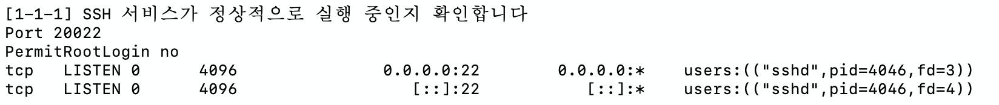
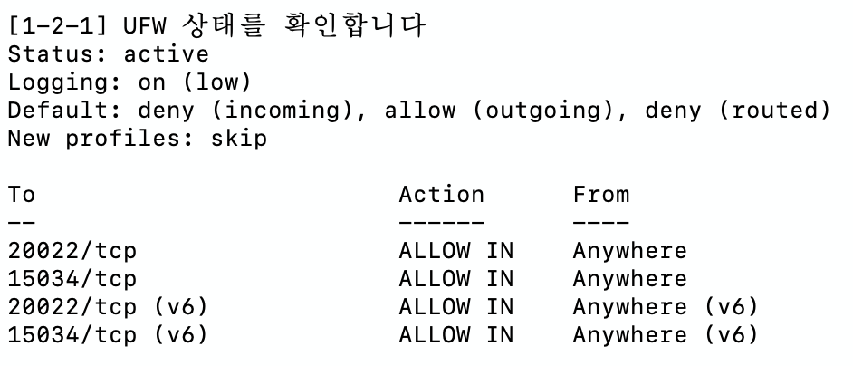
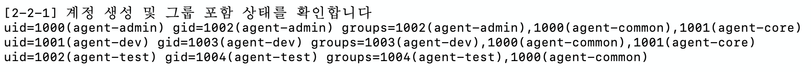

# 리눅스 서버 운영 미션 수행 문서

## 1. 과제 개요

이 과제는 리눅스 서버 환경에서 기본 보안, 계정/그룹/권한 관리, 실행 환경 구성, 그리고 관제 자동화를 한 흐름으로 구성하는 실습이다.

핵심 목표는 다음과 같다.

- SSH 포트를 20022로 변경하고 Root 원격 로그인을 차단한다.
- UFW를 사용해 필요한 포트만 허용한다.
- `agent-admin`, `agent-dev`, `agent-test` 계정과 `agent-common`, `agent-core` 그룹을 구성한다.
- `upload_files`, `api_keys`, `/var/log/agent-app` 디렉토리에 최소 권한 정책을 적용한다.
- `agent-admin` 기준 실행 환경 변수를 고정하고 API 키 파일을 생성한다.
- `monitor.sh`로 시스템 상태를 수집하고 로그에 남기며, cron으로 주기 실행되도록 한다.

구성 스크립트는 [`bin/setup.sh`](bin/setup.sh)에서 관리한다.

## 2. 수행 과정

### 2-1. 기본 보안 및 네트워크 설정

먼저 SSH 설정 파일(`/etc/ssh/sshd_config`)에서 포트를 `20022`로 변경하고 `PermitRootLogin no`를 적용한다. 이후 `sshd -t`로 설정 문법을 검사한 뒤 SSH 서비스를 재시작한다.

방화벽은 UFW를 사용한다. 기본 정책은 인바운드 차단, 아웃바운드 허용으로 두고 `20022/tcp`, `15034/tcp`만 예외적으로 허용한다.

### 2-2. 계정, 그룹, 권한 체계 구성

운영 목적에 맞게 계정을 분리했다.

- `agent-admin`: 운영/관리 및 cron 실행 계정
- `agent-dev`: 개발/운영 및 `monitor.sh` 작성 계정
- `agent-test`: 테스트 계정

그룹은 다음처럼 나눴다.

- `agent-common`: 공용 접근이 필요한 계정용 그룹
- `agent-core`: 핵심 운영 데이터 접근용 그룹

디렉토리는 `AGENT_HOME` 기준으로 구성했다.

- `/home/agent-admin/agent-app`
- `/home/agent-admin/agent-app/upload_files`
- `/home/agent-admin/agent-app/api_keys`
- `/home/agent-admin/agent-app/bin`
- `/var/log/agent-app`

권한 정책은 다음과 같이 적용했다.

- `upload_files`: `agent-common` 그룹이 읽기/쓰기 가능
- `api_keys`: `agent-core` 그룹만 읽기/쓰기 가능
- `/var/log/agent-app`: `agent-core` 그룹만 읽기/쓰기 가능

ACL은 하위 파일에도 동일 정책이 이어지도록 default ACL을 추가하는 방식으로 설정했다.

### 2-3. 애플리케이션 실행 환경 구성

환경 변수는 `/etc/profile.d/agent_env.sh`에 저장해 시스템 전역으로 적용되도록 했다.

설정한 값은 다음과 같다.

```bash
export AGENT_HOME="/home/agent-admin/agent-app"
export AGENT_PORT=15034
export AGENT_UPLOAD_DIR="$AGENT_HOME/upload_files"
export AGENT_KEY_PATH="$AGENT_HOME/api_keys"
export AGENT_LOG_DIR="/var/log/agent-app"
```

또한 `agent-admin` 계정의 셸에서도 이 파일을 읽도록 해 새 셸에서 바로 환경변수가 반영되게 했다.

```bash
source /etc/profile.d/agent_env.sh
```

`setup.sh`를 한 후에 환경변수 설정이 즉시 반영되도록 위 명령어를 실행한다.

## 3. 확인하는 부분

이 과제에서 제출 시 중요하게 봐야 할 확인 항목은 아래와 같다.

### 3-1. SSH 및 방화벽

- SSH 포트가 `20022`인지 확인
- Root 원격 로그인이 차단되었는지 확인
- UFW가 활성화되어 있고 `20022/tcp`, `15034/tcp`만 허용되는지 확인

```bash
sudo grep -E "^(Port|PermitRootLogin)" /etc/ssh/sshd_config
sudo ss -tulnp | grep sshd
sudo ufw status verbose
```




### 3-2. 계정 및 권한

- `agent-admin`, `agent-dev`, `agent-test` 계정이 생성되었는지 확인
- `agent-common`, `agent-core` 그룹이 존재하는지 확인
- 디렉토리 권한과 ACL이 의도한 대로 적용되었는지 확인

```bash
id agent-admin
id agent-dev
id agent-test
```



### 3-3. 환경 변수

- `AGENT_HOME`, `AGENT_PORT`, `AGENT_UPLOAD_DIR`, `AGENT_KEY_PATH`, `AGENT_LOG_DIR`가 올바르게 들어갔는지 확인
- 새 로그인 셸 또는 현재 셸에서 환경 변수가 즉시 읽히는지 확인

```bash
echo "$AGENT_HOME"
echo "$AGENT_PORT"
echo "$AGENT_UPLOAD_DIR"
echo "$AGENT_KEY_PATH"
echo "$AGENT_LOG_DIR"
```

### 3-4. 애플리케이션과 관제

- 제공된 Python 앱이 Boot Sequence 5단계를 모두 `[OK]`로 통과하는지 확인
- 마지막에 `Agent READY`가 출력되는지 확인
- `monitor.sh`가 프로세스/포트/리소스를 수집하고 로그를 남기는지 확인
- `cron`으로 매분 실행되어 `monitor.log`가 누적되는지 확인

## 4. 대표 확인 명령어

```bash
sudo grep -E "^(Port|PermitRootLogin)" /etc/ssh/sshd_config
sudo ss -tulnp | grep sshd
sudo ufw status verbose

id agent-admin
id agent-dev
id agent-test
getent group agent-common
getent group agent-core

ls -ld /home/agent-admin/agent-app /home/agent-admin/agent-app/upload_files /home/agent-admin/agent-app/api_keys /home/agent-admin/agent-app/bin /var/log/agent-app
getfacl /home/agent-admin/agent-app/upload_files
getfacl /home/agent-admin/agent-app/api_keys
getfacl /var/log/agent-app

echo "$AGENT_HOME"
echo "$AGENT_PORT"
cat /home/agent-admin/agent-app/api_keys/t_secret.key
```
