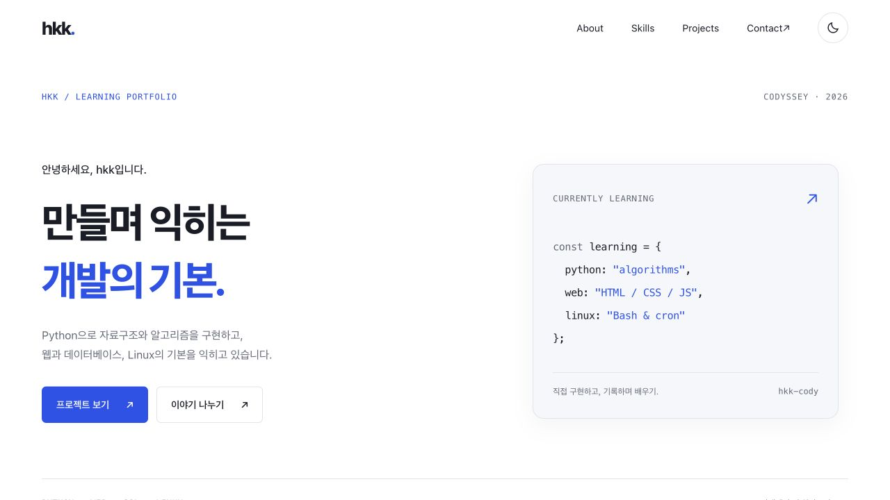
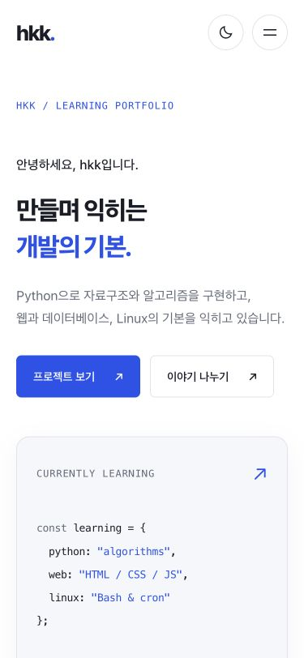
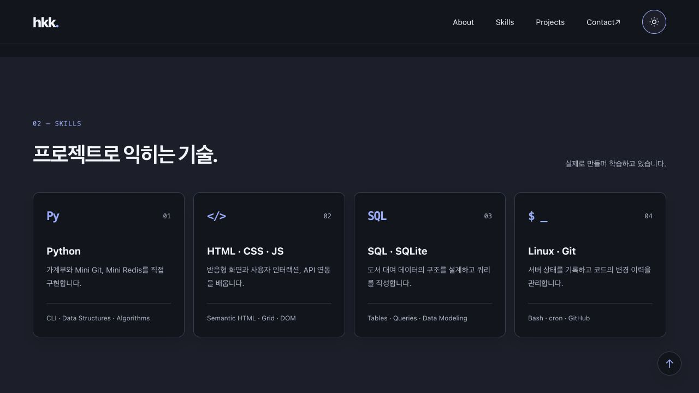

# hkk — Developer Portfolio

Codyssey B1-1 과제를 위한 반응형 자기소개 웹사이트입니다. 화면은 외부 라이브러리나 빌드 도구 없이 HTML, CSS, JavaScript로 구현했습니다. 토큰을 사용하는 로컬 개발에는 Node.js 기본 기능으로 만든 작은 서버를 추가했습니다.

- 저장소: [hkk-cody/B1-1](https://github.com/hkk-cody/B1-1)
- 요구사항: [subject.md](subject.md)
- 수행 기획: [PLAN.md](PLAN.md)
- 처음 배우는 웹 개발: [학습 안내서](LEARNING_GUIDE.md) — 기초 개념, 현재 코드 읽기, 단계별 실습
- GitHub API: 로컬에서는 `.env`를 읽는 서버를 거쳐 조회합니다. GitHub Pages에서는 인증 없이 공개 저장소를 조회합니다.
- 배포 상태: 로컬 구현 완료. GitHub Pages 게시 및 배포 URL 확인은 아직 수행하지 않았습니다.

## 로컬 실행

Node.js 22 이상이 필요합니다. 프로젝트 루트의 `.env`에서 `GITHUB_TOKEN=` 뒤에 발급받은 토큰을 붙여넣습니다. 새로 복제한 저장소라 `.env`가 없다면 `.env.example`을 `.env`로 복사합니다.

```dotenv
GITHUB_TOKEN=여기에_발급받은_토큰을_붙여넣으세요
PORT=4173
```

저장한 뒤 프로젝트 루트에서 실행합니다. 외부 패키지가 없으므로 `npm install`은 필요하지 않습니다.

```sh
npm start
```

브라우저에서 [로컬 미리보기](http://127.0.0.1:4173)를 엽니다. `.env`를 변경하면 서버를 `Ctrl+C`로 종료한 뒤 다시 실행합니다. 토큰을 비워두면 서버도 인증 없이 공개 저장소를 조회합니다.

토큰을 사용할 때는 **Live Server나 `python3 -m http.server` 대신 `npm start`로 실행**합니다. 일반 정적 서버는 `.env`를 읽어 API를 대신 호출하지 못하고, 설정에 따라 `.env` 파일 자체를 공개할 수 있습니다. 추가한 서버는 페이지·CSS·브라우저 JavaScript·이미지만 제공하며 `.env`, `.git`, 서버 소스와 문서는 제공하지 않습니다.

## 구현한 기능

- Hero, About, Skills, Projects, Contact, Footer와 앵커 네비게이션.
- 모바일 퍼스트 반응형 레이아웃: 768px, 1024px 브레이크포인트.
- 모바일 메뉴 열기·닫기, 링크 선택·바깥 클릭·Escape·화면 크기 변경 시 닫기.
- 라이트/다크 테마 전환 및 `portfolio-theme` 키로 localStorage 저장. 첫 방문은 라이트 테마입니다.
- 부드러운 앵커 이동, 스크롤 60px 이상에서 헤더 배경 변경, 300px 이상에서 상단 이동 버튼 표시.
- Intersection Observer 등장 효과: `threshold: 0.2`. 화면보다 긴 요소는 숨기지 않습니다.
- 동작 감소 설정(`prefers-reduced-motion`) 존중, 키보드 포커스 표시와 본문 바로가기.
- 이름·이메일·메시지 검증, 공백 입력 차단, 입력 수정 시 오류 갱신, 첫 오류 필드로 포커스 이동.
- 메시지 글자 수 표시와 최대 3,000자 제한.
- 실제 GitHub 공개 저장소 조회, 대표 학습 프로젝트를 우선하여 최대 6개 카드 표시.
- 로딩·오류·빈 상태 화면과 재시도, 중복 요청 방지, 요청 시간 제한.

문의 폼은 **입력 검증 데모**입니다. 실제 메시지를 보내거나 개인 정보를 저장하지 않습니다. 성공 안내에도 실제 전송이 아님을 표시합니다.

## 폴더 구성

```text
index.html          시맨틱 HTML, 기본 콘텐츠, 접근성 속성
css/style.css       CSS 변수, 반응형, 테마, 인터랙션 스타일
js/config.js        이름, 소개, GitHub 계정, 프로필 이미지, 로컬 프로젝트
js/main.js          프로필 적용, 테마, 메뉴, 스크롤, 등장 효과
js/projects.js      카드와 상태 렌더링
js/github.js        로컬 서버 또는 공개 API 조회, 오류 및 재시도 처리
js/contact.js       문의 폼 상태, 검증, 결과 렌더링
server.mjs          .env를 읽고 GitHub 요청을 대신하는 로컬 Node 서버
package.json        npm start / npm test 명령 (외부 의존성 없음)
.env                실제 토큰 및 로컬 포트, Git에서 제외
.env.example        토큰이 비어 있는 공유용 설정 예제
.gitignore          .env 및 .env.* 제외, .env.example만 허용
tests/              서버와 API 조회 테스트
images/github-avatar.png  GitHub 공개 프로필 이미지
images/screenshots/       데스크톱·모바일·다크 모드 검증 화면
.nojekyll           GitHub Pages에서 정적 파일을 그대로 제공
```

## 내 정보로 바꾸기

`js/config.js`에서 이름, 소개, GitHub 사용자명과 프로젝트를 수정합니다. 현재 표시 이름 `hkk`, 계정 `hkk-cody`, 프로필 이미지는 GitHub 공개 프로필을 기준으로 반영했습니다. GitHub의 자기소개가 비어 있어 홈페이지 소개는 공개 저장소 README에서 확인한 Codyssey 학습 내용을 바탕으로 작성했습니다. 별도의 경력·직장·거주지·연락처는 추가하지 않았습니다.

- 프로필 사진은 `images/`에 추가하고 `profileImage`, `profileImageAlt`를 변경합니다. 현재 이미지는 GitHub에서 제공하는 계정 아바타를 로컬에 저장한 것입니다.
- `featuredRepositories`로 대표 저장소의 표시 순서를 바꾸고, `repositoryDetails`로 제목·설명·태그를 수정합니다. 실제 API 응답에 존재하는 저장소만 표시합니다. 지정한 저장소가 없으면 다른 조회 결과로 채웁니다.
- Skills 목록, Hero 제목 등 고정 문구는 `index.html`에서 수정합니다.
- JavaScript를 꺼도 정적 페이지를 읽을 수 있습니다. 콘텐츠를 확정할 때는 `index.html`의 기본 텍스트·링크·메타데이터도 함께 수정합니다.
- 공개 설정 파일에는 API 토큰이나 비공개 정보를 넣지 않습니다.

반영한 대표 작업은 개인 포트폴리오(B1-1), Mini Git CLI(B5-2), Mini Redis(B5-1), SQLite 도서 대여 DB(B6-1), 가계부 CLI(B2-1), Linux 서버 모니터링(B4-1)입니다. GitHub 설명이 있으면 우선 사용하고, 설명이 비어 있으면 저장소 README를 요약한 소개를 표시합니다.

콘텐츠 확인 출처: [공개 프로필](https://github.com/hkk-cody), [Mini Git CLI](https://github.com/hkk-cody/B5-2#readme), [Mini Redis](https://github.com/hkk-cody/B5-1#readme), [도서 대여 DB](https://github.com/hkk-cody/B6-1#readme), [가계부 CLI](https://github.com/hkk-cody/B2-1#readme), [Linux 서버 운영](https://github.com/hkk-cody/B4-1#readme). 확인일: 2026-09-10.

## 토큰과 GitHub API 동작

GitHub 사용자명은 `js/config.js`의 `githubUsername`에서 바꿉니다. 토큰은 `.env`의 `GITHUB_TOKEN`에만 넣습니다.

```text
로컬: 브라우저 → /api/github/repos → Node 서버 → GitHub API
                                      ↑
                               .env의 토큰 사용

Pages: 브라우저 → GitHub 공개 API (토큰 없음)
```

`js/github.js`가 로컬 주소(`localhost`, `127.0.0.1`)에서는 서버의 `/api/github/repos?username=...`를 호출합니다. 서버는 `GITHUB_TOKEN`을 인증 헤더에 넣어 GitHub에 보내고 공개 카드 필드만 반환합니다. 브라우저 응답과 로그에는 토큰을 포함하지 않습니다.

GitHub Pages 등 외부 호스트에서는 `https://api.github.com/users/{username}/repos?sort=updated&per_page=100`를 직접 호출합니다. `.env`를 다운로드하거나 JavaScript에 토큰을 삽입하는 동작은 없습니다. 토큰의 권한을 바꿔도 이 포트폴리오는 공개 저장소만 표시합니다.

`js/projects.js`는 화면 렌더링을 담당하며 조회 결과는 다음 인터페이스로 전달합니다.

| 메서드 | 역할 |
| --- | --- |
| `setState({ status, projects?, message? })` | `loading`, `success`, `error`, `empty` 상태와 화면 변경 |
| `setRepositories(repositories)` | GitHub 저장소 응답 배열을 최대 6개의 카드로 변환. 빈 배열은 빈 상태 표시 |
| `onRetry(handler)` | 재시도 버튼이 실행할 조회 함수 등록 |

`js/github.js`의 조회 함수는 다음 순서로 동작합니다.

1. `setState({ status: 'loading' })` 호출.
2. `fetch`로 조회하고 `response.ok` 및 응답 형태 확인. 로컬에서는 프록시, Pages에서는 공개 API 사용.
3. 성공 시 `setRepositories(응답배열)` 호출.
4. 실패 시 `setState({ status: 'error' })` 호출.
5. `onRetry(조회함수)`로 재시도를 연결하고 최초 조회 실행.

조회 파일은 `projects.js` 뒤에 `defer`로 연결되어 있습니다. 오류 시 재시도 버튼으로 실제 요청을 다시 보냅니다. GitHub의 401·403·404·429 오류, 잘못된 응답, 네트워크 실패를 처리합니다. 서버 요청 제한 시간은 10초, 브라우저는 15초입니다. 짧은 시간 내 반복 요청은 피하세요.

다음 명령으로 요청 없이 각 화면을 확인할 수 있습니다.

```js
PortfolioProjects.setState({ status: 'loading' });
PortfolioProjects.setState({ status: 'error' });
PortfolioProjects.setRepositories([]);
PortfolioProjects.setState({
  status: 'success',
  projects: PORTFOLIO_CONFIG.projects,
});
```

저장소 이름·설명 등 외부 문자열은 HTML 이스케이프 후 렌더링하고, 카드 링크는 HTTPS GitHub 주소만 허용합니다. 위 상태 확인 명령은 최초 조회가 끝난 후 실행합니다.

## 이벤트 → 상태 → 렌더링

| 기능 | 이벤트 | 상태 변경 | 화면 업데이트 |
| --- | --- | --- | --- |
| 테마 | 버튼 클릭 | `state.theme` 전환 | `data-theme`, 접근성 라벨, localStorage |
| 메뉴 | 버튼 클릭·닫기 동작 | `state.isMenuOpen` 변경 | `active` 클래스, `aria-expanded` |
| 프로젝트 | 초기화·상태 설정·재시도 | `status`, `projects`, `message` 변경 | 카드 또는 상태 메시지, 재시도 버튼 |
| 폼 | `input`, `submit` | `values`, `errors`, `validated`, `submitted` 변경 | 필드 오류, `aria-invalid`, 제출 결과 |

`header`, `nav`, `main`, `section`, `article`, `footer`는 콘텐츠의 역할을 표현합니다. Flexbox는 네비게이션처럼 한 방향의 정렬에, Grid는 카드처럼 행과 열이 필요한 배치에 사용합니다. Projects에는 `auto-fit`과 `minmax`를 적용했습니다.

`querySelector`와 `querySelectorAll`로 요소를 선택하고 `addEventListener`로 동작을 연결합니다. `map`은 카드 HTML 변환, `forEach`는 여러 입력창과 요소의 이벤트 연결에 사용합니다. `innerHTML`은 이스케이프 처리된 카드 렌더링에, `textContent`는 소개·오류·상태 메시지에 사용합니다.

## 검증

기존 화면은 정적 파일과 jsdom 기반 DOM 검사로 검증했습니다. 토큰 서버와 API 조회 코드에는 Node.js 기본 테스트를 추가했습니다. `npm test`로 실행합니다. 테스트는 가짜 토큰과 GitHub 응답을 사용하며 실제 GitHub API를 호출하지 않습니다. DOM 검증은 실제 레이아웃이나 브라우저의 스크롤 애니메이션 검증을 대신하지 않습니다.

| 항목 | 결과 |
| --- | --- |
| JavaScript 문법 검사 | 통과 |
| HTML 연결 및 과제 제약사항 점검 | 통과: 섹션·앵커·label·alt·defer·상대 경로·금지 문법 |
| 테마·메뉴·폼·프로젝트 DOM 동작 | 통과: 저장 복원·저장 차단·메뉴 닫기·스크롤 기준값·폼 오류와 수정·4가지 프로젝트 상태·재시도 |
| 외부 데이터 렌더링 | 통과: HTML 문자열 이스케이프·위험한 링크 차단 |
| 서버와 API 테스트 | 10개 통과: 토큰 전달 분리·비공개 데이터 제외·.env 접근 차단·경로 및 심볼릭 링크 우회 차단·오류·재시도·시간 초과·Pages 조회 |
| 로컬 HTTP 응답 | 200 OK |
| 실제 토큰 인증 | 2026-09-10: `/user` 200 OK, 인증 계정 `hkk-cody` 확인. 토큰 값은 출력하지 않음 |
| 실제 서버 경유 GitHub 조회 | 토큰 사용 상태에서 200 OK, 공개 저장소 12개 응답. 화면에 대표 프로젝트 6개 표시 |
| 실제 브라우저 화면 | 1280px 데스크톱·375px 모바일에서 가로 넘침 없음. 프로필 이미지·실제 카드 링크·모바일 메뉴·다크 모드 확인 |
| 배포 환경 | 미검증 |

문법 검사는 `node --check js/main.js`처럼 각 JavaScript 파일에 실행할 수 있습니다. `.env`의 Git 제외 여부는 `git check-ignore .env`로 확인합니다. `.env`의 파일 권한은 소유자만 읽고 쓸 수 있는 `600`이며, 웹 요청은 404로 차단됩니다.

### 확인한 화면

데스크톱:



모바일:



다크 모드:



제출 전 확인할 항목:

- 375px, 767/768px, 1024px, 1440px에서 가로 넘침과 메뉴 전환 확인.
- 라이트/다크 테마, 새로고침, 키보드 조작, 스크롤 이동과 등장 효과 확인.
- 빈 입력, 공백 입력, 잘못된 이메일, 정상 입력으로 폼 검증 확인.
- 토큰 변경·만료 시 로컬 서버를 재시작한 뒤 GitHub 조회 확인.
- 최종 배포 시점의 화면이 달라졌다면 `images/screenshots/`의 스크린샷 갱신.

## GitHub Pages 배포

브라우저 코드는 빌드 단계 없이 정적 배포할 수 있습니다. GitHub Pages는 정적 호스팅이므로 `server.mjs`와 `.env`를 실행하지 않습니다. 배포된 화면은 토큰 없이 GitHub 공개 API를 사용합니다.

1. 개인 콘텐츠를 마무리하고 `.env`가 추적되지 않는지 확인한 후 파일을 GitHub 저장소에 커밋·푸시합니다.
2. 저장소의 Pages 설정에서 브랜치 배포를 선택하고 `main`의 루트 폴더를 지정합니다.
3. GitHub가 표시하는 실제 배포 URL을 이 README 상단에 기록합니다.
4. 배포 주소에서 이미지·CSS·JavaScript 로드와 전체 기능을 다시 확인합니다.

모든 로컬 자산은 상대 경로를 사용하므로 저장소 이름이 붙는 Pages 하위 경로에서도 로드할 수 있습니다. 이 작업에서는 커밋·푸시와 원격 Pages 설정을 변경하지 않았습니다.

동작 근거: [Node.js 환경 파일 로딩](https://nodejs.org/api/process.html#processloadenvfilepath), [GitHub 공개 저장소 API](https://docs.github.com/en/rest/repos/repos#list-repositories-for-a-user), [GitHub Pages 정적 호스팅](https://docs.github.com/en/pages/getting-started-with-github-pages/what-is-github-pages).
